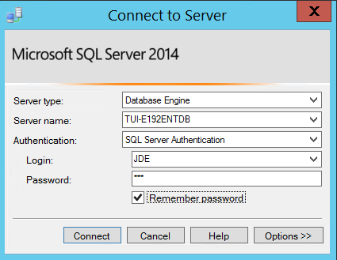
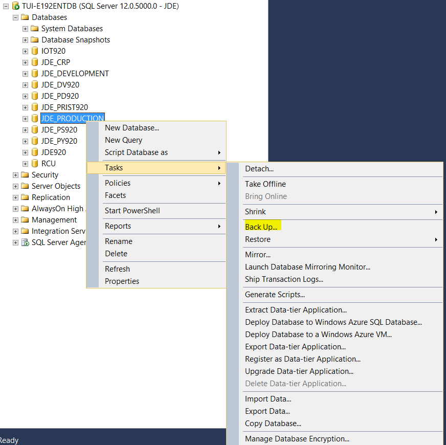
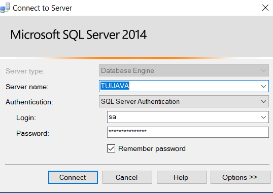
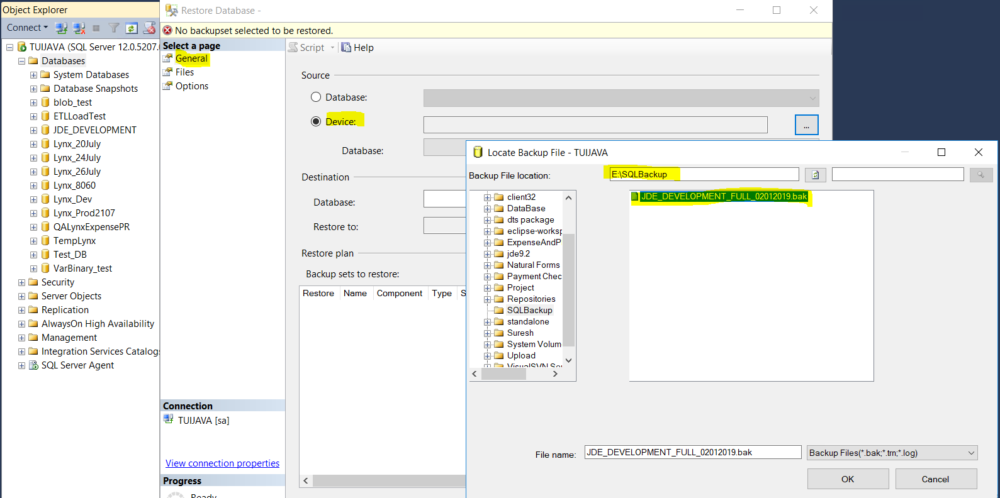
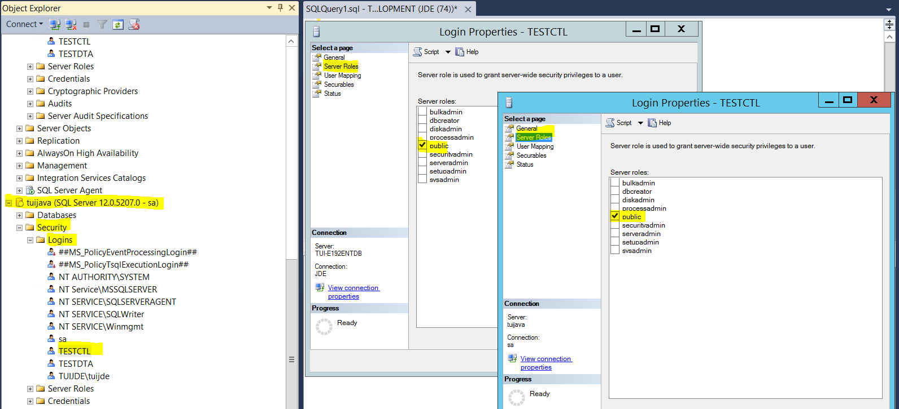

<table>
<thead>
<tr class="header">
<th><strong>Database Refresh</strong></th>
<th></th>
<th></th>
</tr>
</thead>
<tbody>
<tr class="odd">
<td></td>
<td></td>
<td></td>
</tr>
<tr class="even">
<td><strong>Project Name</strong></td>
<td>:</td>
<td><blockquote>

Algilbert

</blockquote></td>
</tr>
<tr class="odd">
<td><strong>Revision Number</strong></td>
<td>:</td>
<td><blockquote>

1.0

</blockquote></td>
</tr>
<tr class="even">
<td><strong>Author</strong></td>
<td>:</td>
<td><blockquote>

Palanikumar

</blockquote></td>
</tr>
<tr class="odd">
<td><strong>Reviewer</strong></td>
<td>:</td>
<td><blockquote>

Nimesh Patel/ Ramesh Dharmaraj

</blockquote></td>
</tr>
<tr class="even">
<td><strong>Project Owner</strong></td>
<td>:</td>
<td><blockquote>

Techunison Inc.

</blockquote></td>
</tr>
</tbody>
</table>

**Document Control**

*Change Record*

### 

| **\#** | **Date**    | **Author Name** | **Version** | **Change Description** |
| ----------------------------- | ---------------------------------- | -------------------------------------- | ---------------------------------- | --------------------------------------------- |
| **1**  | 01-Feb-2019 | Palanikumar     | 1.0         | Modified               |
| **2**  |             |                 |             |                        |

### 

*Reviewers*

| **\#** | **Reviewer Name**               | **Role** |
| ----------------------------- | ------------------------------------------------------ | ------------------------------- |
| **1**  | Nimesh Patel / Ramesh Dharmaraj | Head     |

*Approver*

| **\#** | **Copy\#** | **Recipient Name** | **Role** | **Location** |
| ----------------------------- | --------------------------------- | ----------------------------------------- | ------------------------------- | ----------------------------------- |
| **1**  |            | Nimesh Patel       | Head     | USA          |
| **2**  |            | Ramesh Dharmaraj   | Head     | USA          |

***Note to Holders:***

If you receive an electronic copy of this document and
print it out, please write your name on the equivalent of the cover
page, for document control purposes.

If you receive a hard copy of this document, please
write your name on the front cover, for document control
purposes.

# Backup of Production Database

Note : Refer the credential sheet for the login
credentials corresponding to this server.

This section of the document will provide the details
steps to take a backup of the JDE\_PRODUCTION Database from the
Production server.

**Step: 1**

Open the “**Remote Desktop Connection**” application
from the windows taskbar.

Enter Computer Name/IP: tui-e192entdb /
192.168.1.159

Click “**Connect**”.

**Step: 2**

Enter the credentials for the server as given
below

User Name: TECHUNISON\\TUI-E192ENTDB

Password: \*\*\*\*\*\*\*\*\*\*\*\*\*\*

**Step: 3**

Click “**OK**”, the application will verify the
credentials and establish a remote connection to the machine.

**Step: 4**

Open “**Microsoft SQL Server Management Studio**” on the
remote desktop from the windows taskbar and click “**Connect**” to
connect to a new Database . Enter the details as given below

Server name: tui-e192entdb

Authentication: SQL Server Authentication

Login: JDE

Password: \*\*\*

  

Click “**Connect**”.

**Step: 5**

Right click on the “**JDE\_PRODUCTION**” Database and
navigate to Tasks 🡪 Shrink and select Database.

Check the “**Reorganized files before releasing unused
space**” option.

Set the Maximum free space in files after shrinking as
“**3%**”.

 

Click “**OK**”

**Step: 6**

Right click on the “**JDE\_PRODUCTION**” Database and
navigate to Tasks 🡪 Shrink and select Files.

Select the file type as “**Log**” choose the shrink
action as the “**Release unused space**” option.

Click “**OK**”

**Step: 7**

Right click on “**JDE\_PRODUCTION**” Database and select
Task🡪Back Up option.

Choose the options for the backup as given below

Backup type : “**Full**”

Check the “**Copy-only-backup**” option

Backup destination path: “**E:\\SQLBackup\\
JDE\_PRODUCTION\_FULL\_02012019.bak”**

Click “**OK**”.

  

**Step: 8**

Once the execution completes, the “**JDE\_PRODUCTION”**
Database backup will be available at the following path: E:\\SQLBackup\\
JDE\_PRODUCTION\_FULL\_02012019.bak

The backup of the “**JDE\_PRODUCTION**” Database is
successfully completed.

# Restore of JDE\_DEVELOPMENT Database

This section of the document will provide the detailed
steps to perform a restore operation of the “**JDE\_PRODUCTION**”
database backup to “**JDE\_DEVELOPMENT**” database from the
tui-e192entdb server to the tuijava server.

 

Note:

Refer the credential sheet for the login credentials
corresponding to this server.

Connect the Destination server to follow steps1 to
steps3 from “Backup of PRODUCTION Database”.

**Step: 1**

Copy the JDE\_PRODUCTION Database backup file to the
destination server and rename the file as
“**JDE\_DEVELOPMENT\_FULL\_02012019.bak**” in the path
**“E:\\SQLBackup\\ JDE\_DEVELOPMENT\_FULL\_02012019.bak”.**

**Step: 2**

Open “**Microsoft SQL Server Management Studio**” and
click “**Connect”** to connect to a new Database and enter the details
as given below

Server name: tuijava

Authentication: SQL Server Authentication

Login: JDE

Password: \*\*\*

  

Click “**Connect**”.

**Step: 3**

Right-click on the target destination Database and
navigate to **Tasks🡪Restore** and select “**Database**” option.

**Step: 4**

Enter the following details to restore the
database

Database name : “**JDE\_DEVELOPMENT**”

Choose the from “**Device**” option

Restore database device path : “**E:\\SQLBackup\\
JDE\_DEVELOPMENT\_FULL\_02012019.bak”**

Click “**OK**”.

**Step: 5**

Choose the Restore Option as “**Overwrite the existing
database (With Replace)”** to replace the all the files for that target
Schema. (Schema definitions with data)

**Step: 6**

Click “**OK**”.

The Restore operation will start executing and once it
completes, the system will issue the following prompt.

The restore of the “**JDE\_DEVELOPMENT**” Database is
successfully completed.

# Check SQL Login Accounts 

Using the SQL Script, we can identify the Login account
access details for restored database “JDE\_DEVELOPMENT” from “tuijava”
server. Follow the below detailed steps.

**Step: 1**

Open Microsoft SQL Server Management Studio and click
connect for new Database.

Server name: tuijava

Authentication: SQL Server Authentication

Login: JDE

Password: \*\*\*

  

Click “**Connect”**.

**Step: 2**

Right click on JDE\_DEVELOPMENT and select new query,
from the query window copy the below query and “execute” one by
one.

use JDE\_DEVELOPMENT

go

sp\_adduser 'TESTDTA','TESTDTA'

go

sp\_adduser 'TESTCTL','TESTCTL'

go

sp\_adduser 'DV920','DV920'

go

use JDE\_DEVELOPMENT

> go
> 
> SP\_CHANGE\_USERS\_LOGIN
> 'UPDATE\_ONE','TESTCTL','TESTCTL'
> 
> GO
> 
> SP\_CHANGE\_USERS\_LOGIN
> 'UPDATE\_ONE','TESTDTA','TESTDTA'
> 
> GO
> 
> SP\_CHANGE\_USERS\_LOGIN
> 'UPDATE\_ONE','DV920','DV920'
> 
> GO

create schema TESTCTL authorization TESTCTL;

create schema TESTDTA authorization TESTDTA;

use JDE\_DEVELOPMENT

> go
> 
> select 'alter schema TESTCTL transfer PRODCTL.' + name
> from sysobjects where type ='u' and user\_name (uid) like '%prodctl%'
> order by name
> 
> 
> 
> go
> 
> select 'alter schema TESTDTA transfer PRODDTA.' + name
> from sysobjects where type ='u' and user\_name (uid) like '%proddta%'
> order by name
> 
> 
> 
> go
> 
> select 'alter schema TESTDTA transfer PRODDTA.' + name
> from sysobjects where type ='V' and user\_name (uid) like '%proddta%'
> order by name

use JDE\_DEVELOPMENT

> EXEC sp\_addrolemember N'db\_owner', N'TESTDTA'
> 
> GO
> 
> 
> 
> EXEC sp\_addrolemember N'db\_owner', N'TESTCTL'
> 
> GO
> 
> 
> 
> EXEC sp\_addrolemember N'db\_owner', N'JDE'
> 
> GO
> 
> 
> 
> EXEC sp\_addrolemember N'db\_owner', N'DV920'
> 
> GO

ALTER USER TESTDTA WITH LOGIN =TESTDTA

ALTER USER TESTCTL WITH LOGIN =TESTCTL

ALTER ROLE \[JDEADMIN\] ADD MEMBER \[JDE\];

**Step: 2**

We can identify the user’s login account access for
restored database “JDE\_DEVELOPMENT” on tuijava server like as source
database production server “JDE\_PRODUCTION” database login account
access.

The Login Accounts are:

1.  > TESTCTL

2.  > TESTDTA

# Ensure Permission for SQL Login Accounts 

To ensure the login accounts permissions with parameters
are same from “JDE\_PRODUCTION” Database and “JDE\_DEVELOPMENT” from
tui-e192entdb to tuijava server. Follow the bellow detailed
steps.

**Step: 1**

Check TESTCTL account parameters on both Databases
Servers tui-e192entdb and tuijava:

1)  > Server Roles:

2)  > User Mapping:

3)  > Securables:

**Step: 2**

Check TESTDTA account parameters on both Databases
Servers tui-e192entdb and tuijava:

1)  > Server Roles:

2)  > User Mapping:

3)  > Securables:

**-----Thank You-----**

