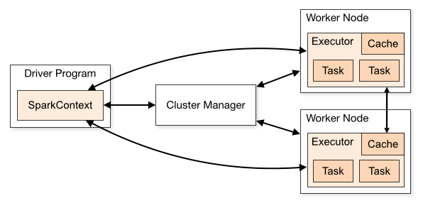
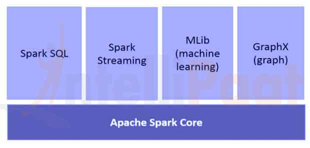

1.  **Introduction to Spark**

[**Apache Spark**](https://spark.apache.org/) is an open-source
cluster-computing framework. It provides elegant development APIs for
Scala, Java, Python, and R that allow developers to execute a variety of
data-intensive workloads across diverse data sources including HDFS,
Cassandra, HBase, S3 etc.

Historically, Hadoop’s MapReduce proved to be inefficient for some
iterative and interactive computing jobs, which eventually led to the
development of Spark. With Spark, we can run logic up to two orders of
magnitude faster than with Hadoop in memory, or one order of magnitude
faster on disk.

2.  **Spark Architecture**

Spark applications run as independent sets of processes on a cluster as
described in the
below [diagram](https://spark.apache.org/docs/latest/cluster-overview.html):

  - These set of processes are coordinated by the *SparkContext* object
    in your main program (called the driver
    program). *SparkContext *connects to several types of cluster
    managers (either Spark’s own **standalone cluster manager**, Mesos
    or YARN), which allocate resources across applications.

  - Once connected, Spark acquires executors on nodes in the cluster,
    which are processes that run computations and store data for your
    application.

  - Next, it sends your application code (defined by JAR or Python files
    passed to *SparkContext*) to the executors.
    Finally, ***SparkContext* sends tasks to the executors to run**.

  - Spark can also be configured to run on Standalone mode.
    <http://spark.apache.org/docs/1.2.1/spark-standalone.html#cluster-launch-scripts>

<!-- end list -->

3.  **Core Components**
    
    The
    following [diagram](https://intellipaat.com/tutorial/spark-tutorial/apache-spark-components/) gives
    the clear picture of the different components of Spark

1.  **Spark Core**

Spark Core component is accountable for all the basic I/O
functionalities, scheduling and monitoring the jobs on spark clusters,
task dispatching, networking with different storage systems, fault
recovery, and efficient memory management.

**Resilient Distributed Datasets are immutable, a partitioned collection
of records that can be operated on – in parallel and allows –
fault-tolerant ‘in-memory’ computations**.

RDDs support two kinds of operations:

  - Transformation – Spark RDD transformation is a function that
    produces new RDD from the existing RDDs. **The transformer takes RDD
    as input and produces one or more RDD as output**. Transformations
    **are lazy in nature** i.e., they get execute when we call an
    **action**

<!-- end list -->

  - Action** – **transformations create RDDs from each other, but when
    we want to work with the actual data set, at that point action is
    performed. Thus, ***Actions* are Spark RDD operations that give
    non-RDD values. **The values of action are stored to drivers or to
    the external storage system

An action is one of the ways of sending data from **Executor to the
driver**.

Executors are agents that are responsible for executing a task. While
the driver is a JVM process that coordinates workers and execution of
the task. Some of the actions of Spark are count and collect.

2.  **Spark SQL**

Spark SQL is a Spark module for **structured data processing**. It’s
primarily used to execute SQL queries. ***DataFrame*** constitutes the
main abstraction for Spark SQL**. Distributed collection of data**
ordered into named columns is known as a ***DataFrame*** in Spark.

Spark SQL supports fetching data from different sources like **Hive,
Avro, Parquet, ORC, JSON, and JDBC**. It also scales to thousands of
nodes and multi-hour queries using the Spark engine – which provides
full mid-query fault tolerance.

<https://spark.apache.org/docs/1.6.0/sql-programming-guide.html#manually-specifying-options>

3.  **Spark Streaming**

Spark Streaming is an **extension** of the core **Spark API** that
enables scalable, **high-throughput, fault-tolerant** **stream**
processing of **live data** streams. Data can be ingested from a number
of sources, such as Kafka, Flume, Kinesis, or TCP sockets.

Finally, processed data can be pushed out to file systems, databases,
and live dashboards.

<https://spark.apache.org/docs/2.2.0/streaming-programming-guide.html>

4.  **Spark MLlib**

MLlib is Spark’s machine learning (ML) library. Its goal is to make
practical machine learning scalable and easy. At a high level, it
provides tools such as:

  - **ML Algorithms** – common learning algorithms such as
    classification, regression, clustering, and collaborative filtering

  - **Featurization** – feature extraction, transformation,
    dimensionality reduction, and selection

  - **Pipelines** – tools for constructing, evaluating, and tuning ML
    Pipelines

  - **Persistence** – saving and load algorithms, models, and Pipelines

  - **Utilities** – linear algebra, statistics, data handling, etc.
    
    5.  **Spark GraphX**

GraphX is a component for **graphs and graph-parallel** computations. At
a high level, GraphX extends the Spark RDD by introducing a new Graph
abstraction: a directed multigraph with properties attached to each
vertex and edge.

To support graph computation, GraphX exposes a set of fundamental
operators (e.g., *subgraph*, *joinVertices*, and *aggregateMessages*).

In addition, GraphX includes a growing collection of graph algorithms
and builders to simplify graph analytics tasks.

**Spark Configuration:**

Spark provides three locations to configure the system:

  - > [Spark
    > properties](http://spark.apache.org/docs/1.2.1/configuration.html#spark-properties) control
    > most application parameters and can be set by using
    > a [SparkConf](http://spark.apache.org/docs/1.2.1/api/scala/index.html#org.apache.spark.SparkConf) object,
    > or through Java system properties.

  - > [Environment
    > variables](http://spark.apache.org/docs/1.2.1/configuration.html#environment-variables) can
    > be used to set per-machine settings, such as the IP address,
    > through the conf/spark-env.sh script on each node.

  - > [Logging](http://spark.apache.org/docs/1.2.1/configuration.html#configuring-logging) can
    > be configured through log4j.properties.

> Refer link for Spark Configuration and available properties
> <http://spark.apache.org/docs/1.2.1/configuration.html>

## **Tuning Parallelism**

Spark, as you have likely figured out by this point, is a parallel
processing engine. What is maybe less obvious is that Spark is not a
“magic” parallel processing engine, and is limited in its ability to
figure out the optimal amount of parallelism. Every Spark stage has a
number of tasks, each of which processes data sequentially. In tuning
Spark jobs, this number is probably the single most important parameter
in determining performance.

The number of tasks in a stage is the same as the number of partitions
in the last RDD in the stage. The number of partitions in an RDD is the
same as the number of partitions in the RDD on which it depends, with a
couple exceptions: the **coalesce** transformation allows creating an
RDD with fewer partitions than its parent RDD, the
**union** transformation creates an RDD with the sum of its parents’
number of partitions, and **cartesian** creates an RDD with their
product. The number of partition can be increased by

  - > Use the repartition transformation, which will trigger a shuffle.

  - > Configure your Input Format to create more splits.

  - > Write the input data out to HDFS with a smaller block size.

  - 
The following covers the 3 main aspects - number of executors, executor
memory and number of cores calculation in cluster mode of operation.

  - **Case 1 Hardware - 6 Nodes, and Each node
    16 cores, 64 GB RAM:**

Each executor is a JVM instance. So, we can have multiple executors in a
single Node

First 1 core and 1 GB is needed for OS and Hadoop Daemons, so available
are 15 cores, 63 GB RAM for each node

1.  ***Start with how to choose number of cores*:**

**Number of cores = Concurrent tasks as executor can run**

So, we might think, more concurrent tasks for each executor will give
better performance. But research shows that any application with more
than 5 concurrent tasks, would lead to bad show. So, stick this to 5.
This number came from the ability of executor and not from how many
cores a system has. So, the **number 5 stays same** even if you have
double (32) cores in the CPU.

2.  ***Number of executors:***

Coming back to next step, with **5 as cores per executor**, and **15 as
total available cores** in one Node (CPU) - we come to **3 executors per
node**.

So, with 6 nodes, and 3 executors per node - we get **18 executors**.
Out of 18 we need 1 executor (java process) for **AM** in YARN we get
**17 executors.**

This 17 is the number we give to spark using **--num-executors** while
running from spark- submit shell command

3.  ***Memory for each executor:***
    
    From above step, we have **3 executors per node**. And available
    **RAM is 63 GB** So memory for each executor is **63/3 = 21GB**.

However small overhead memory is also needed to determine the full
memory request to YARN for each executor.

Formula for that overhead is max (384, .07 \* spark.executor.memory)

Calculating that overhead - .07 \* 21 (Here 21 is calculated as above
63/3)

\= 1.47

Since 1.47 GB \> 384 MB, the overhead is 1.47.

Take the above from each 21 above =\> 21 - 1.47 \~ 19 GB

So **executor memory - 19 GB**

**Final numbers** - Executors - 17, Cores 5, Executor Memory - 19 GB

  - **Case 2 Hardware - Same 6 Node, 32
    Cores, 64 GB RAM:**

5 is same for good concurrency

Number of executors for each node = 32/5 \~ 6

So total executors = 6 \* 6 Nodes = 36. Then final number is 36 - 1 for
AM = 35

Executor memory is: 6 executors for each node. 63/6 \~ 10. Overhead is
.07 \* 10 = 700 MB. So, rounding to 1GB as overhead, we get 10-1 = 9 GB

**Final numbers - Executors - 35, Cores 5, Executor Memory - 9 GB**

  - **Case 3**

The above scenarios start with accepting number of cores as fixed and
moving to \# of executors and memory.

Now for first case, if we think we don’t need 19 GB, and just 10 GB is
sufficient, then following are the numbers:

cores 5 \# of executors for each node = 3

At this stage, this would lead to 21, and then 19 as per our first
calculation. But since we thought 10 is ok (assume little overhead),
then we can’t switch \# of executors per node to 6 (like 63/10). Becase
with 6 executors per node and 5 cores it comes down to 30 cores per
node, when we only have 16 cores. So, we also need to change number of
cores for each executor.

So calculating again,

The magic number 5 comes to 3 (any number less than or equal to 5). So
with 3 cores, and 15 available cores - we get 5 executors per node. So
(5\*6 -1) = 29 executors

So memory is 63/5 \~ 12. Over head is 12\*.07=.84 So executor memory is
12 - 1 GB = 11 GB

**Final Numbers are 29 executors, 3 cores, executor memory is 11 GB**
